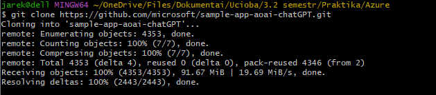
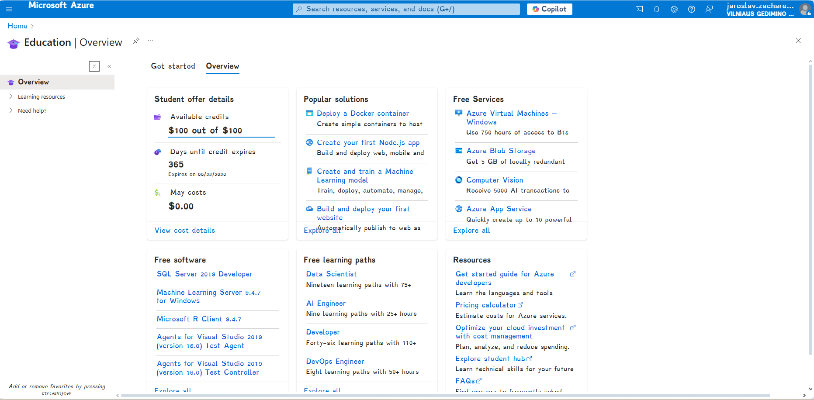
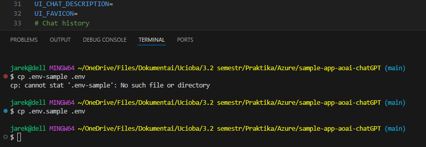
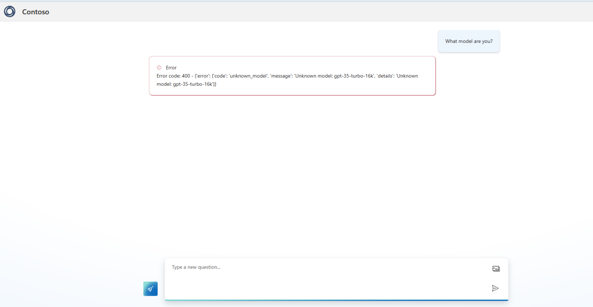
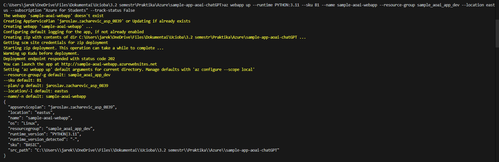
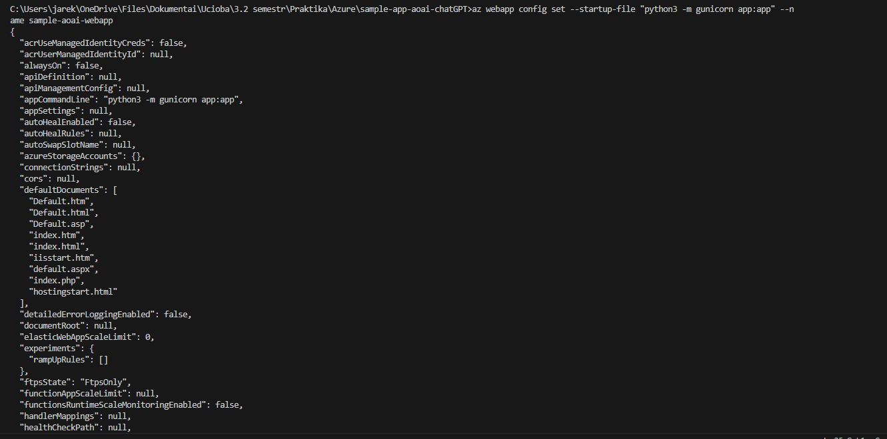
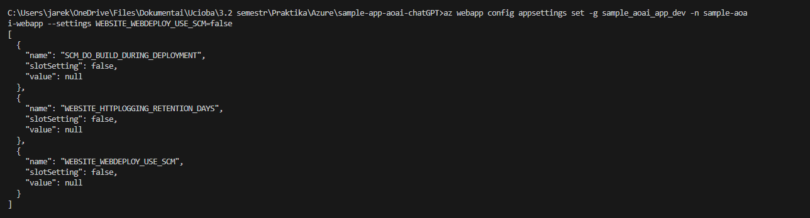
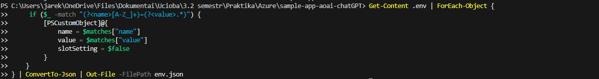
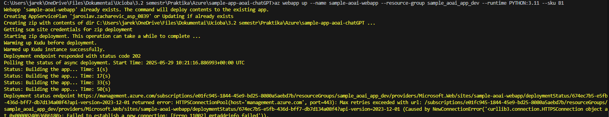

## Bandymas paleisti lokaliai

1.  Iš pradžių klonavau repozitorija lokaliai pas save per git bash.

„ git clone <https://github.com/microsoft/sample-app-aoai-chatGPT.git>"

2.  Sukūriau Azure paskyrą.

3. Atsisiunčiau AZ CLI 

4.  AOAI setupas.

Regioną palikau, kaip East US, kad
išvengti busimų nesutapimų, nes:

5.  Lokalios aplinkos tvarkymas

6.  Paleidęs aplikaciją susiduriau su 500 server error

Greitai pastebėjau klaidą, kad įterpiau endpointą .env faile į
„AZURE_OPENAI_RESOURCE="

7.  Sekanti klaidą susijusi taip pat dėl blogo įterpimo

> Problema iškilo dėl „AZURE_OPENAI_MODEL=". Iš
> nežinojimo nebuvau sukūręs modelio Azure Ai foundry. Darant
> deploymenta ten susiduriau su kvotų apribojimų visose regionose
> visiems modeliams sample-aoai-app scopui, todėl turėjau paprašyti
> kvotų butent šiam scopui.

Po kvotų suteikimo, viskas veikė puikiai.

## Deploymentas naudojant AZ CLI

1.  Konfigūravimas

Root direktorijoje surašiau tokią eilutę, iš repo: „az webapp up
\--runtime PYTHON:3.11 \--sku B1 \--name \<new-app-name\>
\--resource-group \<resource-group-name\> \--location \<azure-region\>
\--subscription \<subscription-name\>" su --track-status False, dėl
\"2.73.0\" azure-cli versijos, ir pabandžiau išjungti AUTH_ENABLED.

Turėjau keletą nereikšmingų klaidų, kurios greitai sprendžiamos, vienas
iš pavyzdžių tai:

2. Problema "the subscription is not
registered to use namespace 'Microsoft.Web'.

Išsprendžiau „az provider register --namespace Microsoft.Web" eilute.

3\. Paleidimas

3\. Startup komandos nustatymas.

4\. SCM išjungimas

5. Perkelimas .env į JSON formatą

6. .env įkelimas

7.Aplikacijos atnaujinimas

Darant šį žingsnį susiduriau su tokia klaida:

Nesigilinau stipriai į šią problemą, nes
pabandžiau greitai pakeisti internetą iš Wi-fi į mobilųjį, nes tuo metu
kai kuriau konfiguraciją naudojau telefono ryšį, tad buvo įtarimas, kad
problema susijusi su tuo ir tai suveikė.

8.  Start-up file'o nustatymas

9.  Aplikacijos patikrinimas

Kuriant konfigūraciją buvau nustatęs, autentifikavimo argumentą, bet
kažkodėl tai nesuveikė.

10. AUTH_ENABLE atnaujinimas 

11. Aplikacijos patikrinimas

## Apibendrinamas:

Iš pradžių pabandžiau paleisti aplikaciją lokaliai, kur didžiausia
problema buvo kvotų apribojimas ir nežinojimas, kad reikia dar sukurti
AI foundry deploymentą.

Darant deploymenta su Azure CLI, nesusiduriau su didesniomis
problemomis, nes dokumentacija yra labai aiški. Greičiausiai problema
7-tame punkte yra susijusi su tinklu nustatymu, bet neatsirado poreikio
gilintis toliau, nes greitai išsprendžiau šią problemą pakeitus tinklą,
kuriame dariau konfigūraciją.

Aplikaciją galima patikrinti -
https://sample-aoai-webapp.azurewebsites.net
